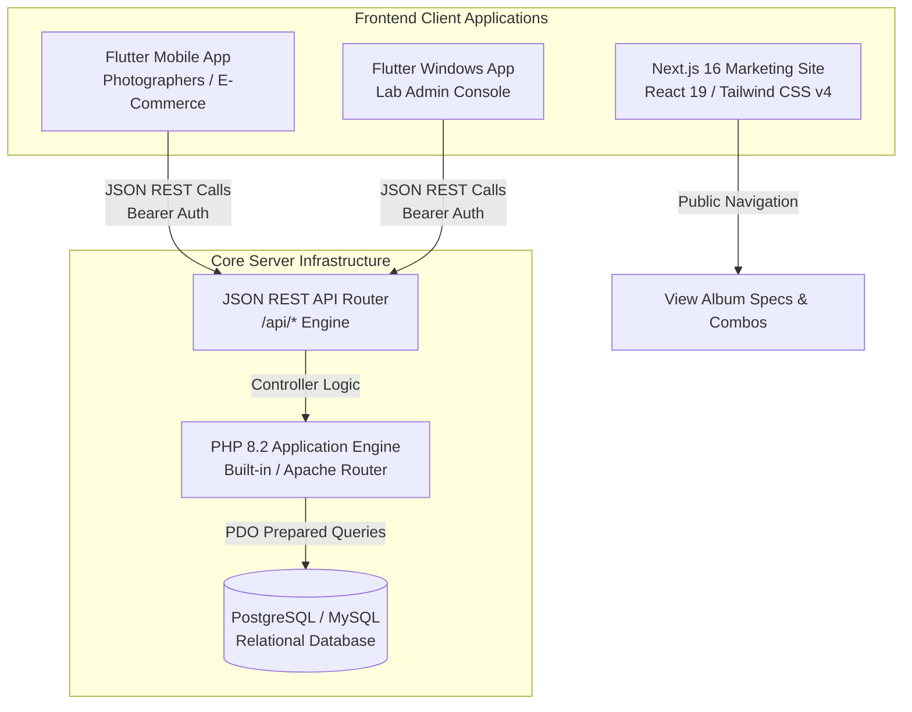
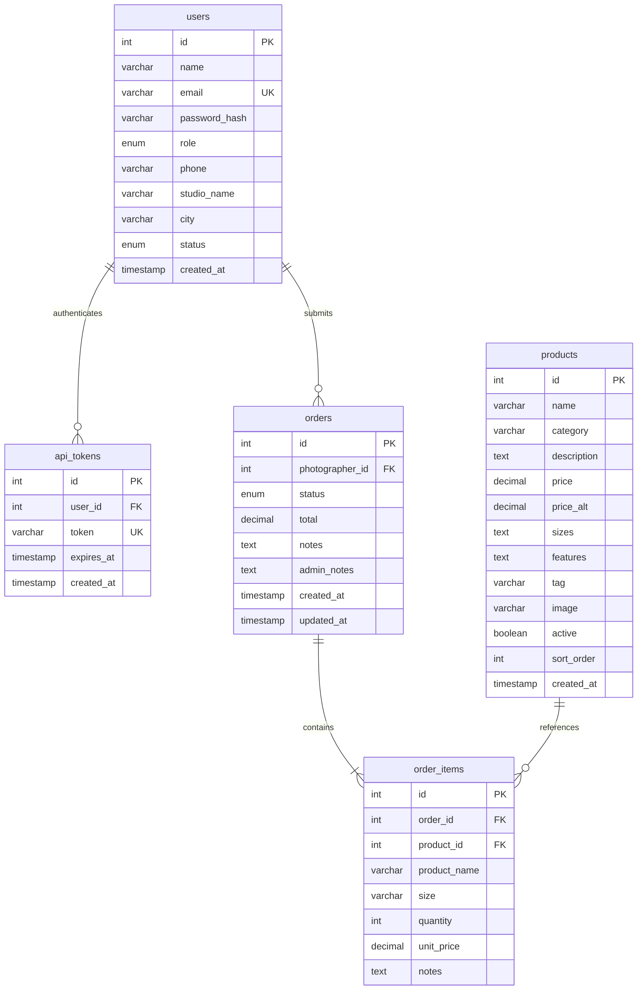

# Technical Architecture & System Specifications

This document outlines the system topology, directory structure, database schema, and Flutter architecture patterns of the unified **SD Colours Photobook Lab** ecosystem.

---

## 1. System Topology & Data Flow

The system operates as a centralized hub-and-spoke model, with the PHP backend serving as the central coordinator for relational data, static image assets, and client APIs.



1. **User Request Routing**: All administrative web actions and REST API calls hit the PHP core.
2. **REST API Mapping**: The mobile app and desktop client communicate exclusively via `application/json` JSON requests. The request authorization status is validated via a `Bearer <token>` string included in the HTTP headers.
3. **Database Access**: Relational persistence uses PHP Data Objects (PDO) with strict prepared statements, enabling the application to connect seamlessly to PostgreSQL in cloud deployments or MySQL/MariaDB in local development environments.

---

## 2. Monorepo Directory Layout

The workspace is organized into a single monorepo to simplify development, version tracking, and shared asset access:

```
sdcolourslab-website/
├── doc/                        # Universal Ecosystem Documentation
│   ├── prd.md                  # Product Requirements Document
│   ├── architecture.md         # System Architecture & Technical Specifications
│   ├── api_endpoints.md        # Complete REST API Reference
│   └── tracker.md              # Feature Progress & Development Roadmap
├── src/                        # Next.js 16 Public Website Source
│   ├── app/                    # Next.js App Router (React 19 Pages)
│   │   ├── page.tsx            # Homepage Hero & Live Highlights
│   │   ├── layout.tsx          # Nav, Meta Headers, Base UI Context
│   │   ├── about/              # History & Rourkela Printing Standards
│   │   ├── contact/            # Google Map, Inquiry Forms
│   │   ├── gallery/            # Interactive Media Grid
│   │   ├── pricing/            # Responsive Rate Cards
│   │   └── products/           # Browse Signature Albums & Combos
│   └── components/             # Reusable UI (Buttons, Gradients)
├── sdcolorslab/                # Central PHP Backend & APIs
│   ├── index.php               # Legacy Public Home & Direct Landing
│   ├── router.php              # Central Request Router & Static File Handler
│   ├── database.sql            # Core SQL Database Schema (Postgres/MySQL compatible)
│   ├── style.css               # Legacy Web Stylesheet
│   ├── includes/               # Modular PHP Code Blocks
│   │   ├── db.php              # PDO Multi-Dialect Connection Broker
│   │   ├── auth.php            # Session & Cookie Verification Guard
│   │   ├── header.php          # Shared HTML Header & Nav Links
│   │   └── footer.php          # Shared HTML Footer & Contact Info
│   ├── admin/                  # Administrative Web Portal Pages
│   │   ├── index.php           # Admin Dashboard Grid
│   │   ├── orders.php          # Batch Orders Management
│   │   ├── products.php        # Products Management Console
│   │   └── photographers.php   # Account Verification Manager
│   ├── photographer/           # Web Photographer Member Portal
│   │   ├── index.php           # Account Dashboard
│   │   ├── shop.php            # Online Catalog & Size Configurator
│   │   ├── cart.php            # Active Session-based Shopping Cart
│   │   ├── checkout.php        # Checkout Page & Notes Handler
│   │   └── orders.php          # My History & Invoices List
│   ├── api/                    # REST JSON API Handlers
│   │   ├── index.php           # Core API Endpoint Multiplexer
│   │   └── docs.php            # Live, Self-Hosted API Documentation
│   └── images/                 # Logo and Combo Product Monograms
│       └── combos/             # High-Resolution Marketing Assets
├── lab_desktop_app/            # Flutter Windows Administrative App
│   ├── pubspec.yaml            # Windows Native Dependencies & Assets
│   ├── lib/                    # Flutter Application Core
│   │   ├── main.dart           # Windows Process Entry Point & Multi-Provider Bindings
│   │   ├── models/             # Serialization Models (Order, User, Product)
│   │   ├── services/           # HTTP Request Brokers
│   │   ├── providers/          # MVVM State Engines (Auth, Order, Catalog)
│   │   └── screens/            # High-Resolution Desktop Interfaces
└── photographer_mobile_app/    # Flutter Android/iOS E-Commerce App
    ├── pubspec.yaml            # Mobile Device Dependencies & Plugins
    └── lib/                    # Mobile Application Core
        ├── main.dart           # App Init & Route Guards
        ├── models/             # Mobile Data Models (CartItem, User, Order)
        ├── services/           # Mobile API Connection Broker
        ├── providers/          # Mobile State Engines (Cart, Catalog, Auth)
        └── screens/            # Responsive Native View Screens
```

---

## 3. Database Schema & Data Models

The relational database schema is structured for full referential integrity. It is optimized to support PostgreSQL (using standard type definitions) and MySQL/MariaDB (as structured in `database.sql`).



### 3.1 Table Definition: `users`
Represents administrative operators and professional B2B photographers.
* **Fields**:
  * `id`: Unique user identifier. `INT UNSIGNED NOT NULL AUTO_INCREMENT` (MySQL) or `SERIAL` (PostgreSQl). Primary Key.
  * `name`: User's full name. `VARCHAR(150) NOT NULL`.
  * `email`: Unique email address. `VARCHAR(200) NOT NULL`. Unique Index.
  * `password_hash`: Secure Blowfish/Bcrypt hashed password. `VARCHAR(255) NOT NULL`.
  * `role`: System access level. `ENUM('admin', 'photographer') NOT NULL DEFAULT 'photographer'`.
  * `phone`: Mobile contact number. `VARCHAR(20)`.
  * `studio_name`: Registered photography business name. `VARCHAR(200)`.
  * `city`: Primary service city location. `VARCHAR(100)`.
  * `status`: Verification check. `ENUM('pending', 'approved', 'rejected') NOT NULL DEFAULT 'pending'`.
  * `created_at`: Sign up date. `DATETIME NOT NULL DEFAULT CURRENT_TIMESTAMP`.

### 3.2 Table Definition: `api_tokens`
Manages native mobile and desktop API authentication sessions.
* **Fields**:
  * `id`: Unique token sequence. `INT UNSIGNED NOT NULL AUTO_INCREMENT` / `SERIAL`. Primary Key.
  * `user_id`: Owning user identifier. `INT UNSIGNED NOT NULL` (Foreign Key -> `users.id` ON DELETE CASCADE).
  * `token`: Unique cryptographically randomized token string. `VARCHAR(100) NOT NULL`. Unique Index.
  * `expires_at`: Token lifespan limit (Default: 30 days). `DATETIME NOT NULL`.
  * `created_at`: Creation date. `DATETIME NOT NULL DEFAULT CURRENT_TIMESTAMP`.

### 3.3 Table Definition: `products`
The print catalog, including albums, acrylic frames, and customizable combo packages.
* **Fields**:
  * `id`: Unique product number. `INT UNSIGNED NOT NULL AUTO_INCREMENT` / `SERIAL`. Primary Key.
  * `name`: Product name. `VARCHAR(200) NOT NULL`.
  * `category`: Broad division. `VARCHAR(100)` (e.g., `'album'`, `'combo'`, `'led_frame'`, `'wall_acrylic'`).
  * `description`: Explanatory details. `TEXT`.
  * `price`: Base cost in INR. `DECIMAL(10,2) NOT NULL DEFAULT 0.00`.
  * `price_alt`: Secondary/bulk page cost in INR. `DECIMAL(10,2)`.
  * `sizes`: Available sizes list. `TEXT` or `JSON` (e.g. `["12x24", "12x30", "12x36"]`).
  * `features`: Bulleted details. `TEXT` or `JSON` (e.g. `["Cover Leather Pad", "Leather Photo Bag"]`).
  * `tag`: Special label. `VARCHAR(100)` (e.g. `'Best Seller'`, `'Premium'`).
  * `image`: Local asset path. `VARCHAR(300)`.
  * `active`: Toggle for store display. `TINYINT(1)` / `BOOLEAN NOT NULL DEFAULT 1`.
  * `sort_order`: Sequential layout weight. `INT NOT NULL DEFAULT 0`.
  * `created_at`: Creation timestamp. `DATETIME NOT NULL DEFAULT CURRENT_TIMESTAMP`.

### 3.4 Table Definition: `orders`
Invoices submitted by approved photographers for production.
* **Fields**:
  * `id`: Auto-incrementing order ID. `INT UNSIGNED NOT NULL AUTO_INCREMENT` / `SERIAL`. Primary Key.
  * `photographer_id`: Submitting user. `INT UNSIGNED NOT NULL` (Foreign Key -> `users.id` ON DELETE CASCADE ON UPDATE CASCADE).
  * `status`: Current production step. `ENUM('pending', 'processing', 'shipped', 'delivered', 'cancelled') NOT NULL DEFAULT 'pending'`.
  * `total`: Sum total of all items in INR. `DECIMAL(10,2) NOT NULL DEFAULT 0.00`.
  * `notes`: Special printing instructions provided by customer. `TEXT`.
  * `admin_notes`: Production details or comments added by lab admins. `TEXT`.
  * `created_at`: Invoice creation date. `DATETIME NOT NULL DEFAULT CURRENT_TIMESTAMP`.
  * `updated_at`: Last state modification. `DATETIME NOT NULL DEFAULT CURRENT_TIMESTAMP ON UPDATE CURRENT_TIMESTAMP`.

### 3.5 Table Definition: `order_items`
Individual line items within a submitted order.
* **Fields**:
  * `id`: Line item identifier. `INT UNSIGNED NOT NULL AUTO_INCREMENT` / `SERIAL`. Primary Key.
  * `order_id`: Containing invoice. `INT UNSIGNED NOT NULL` (Foreign Key -> `orders.id` ON DELETE CASCADE ON UPDATE CASCADE).
  * `product_id`: Linked catalog entry. `INT UNSIGNED` (Foreign Key -> `products.id` ON DELETE SET NULL ON UPDATE CASCADE).
  * `product_name`: Snapshot of product name at time of order. `VARCHAR(200) NOT NULL`.
  * `size`: Configured size selection. `VARCHAR(100)`.
  * `quantity`: Order count. `INT NOT NULL DEFAULT 1`.
  * `unit_price`: Unit price in INR at time of order. `DECIMAL(10,2) NOT NULL`.
  * `notes`: Additional customizations for this specific item. `TEXT`.

---

## 4. Flutter MVVM & Provider Architecture

Both `lab_desktop_app` and `photographer_mobile_app` utilize a highly structured **Model-View-ViewModel (MVVM)** pattern combined with **Provider** for clean state propagation.

```
┌────────────────────────────────────────────────────────┐
│                        VIEW                            │
│           (Flutter UI Screens & Widgets)               │
└───────────────────────────┬────────────────────────────┘
                            │ Actions / Rebuilds
                            ▼
┌────────────────────────────────────────────────────────┐
│                     VIEWMODEL                          │
│        (Provider / ChangeNotifier Classes)             │
│   e.g. AuthProvider, OrderProvider, CartProvider       │
└───────────────────────────┬────────────────────────────┘
                            │ Fetch Data / Mutate
                            ▼
┌────────────────────────────────────────────────────────┐
│                   SERVICE & MODEL                      │
│        (Data Classes & Central REST API Client)        │
└────────────────────────────────────────────────────────┘
```

### 4.1 State Management (Providers)
Providers manage and persist state in memory across screen re-renders, notifying listeners upon data modifications:

* **`AuthProvider`**:
  * Exposes: `currentUser`, `authToken`, `loginStatus` (Authenticated/Unauthenticated/Pending).
  * Methods: `login(email, password)`, `register(profile)`, `logout()`. Loads cached tokens from disk on app start.
* **`CatalogProvider`**:
  * Exposes: `productsList`, `categories`, `isLoading`.
  * Methods: `fetchActiveProducts()` (Mobile) or `fetchAllProducts()` (Desktop), `toggleProductStatus()`.
* **`CartProvider` (Mobile Only)**:
  * Exposes: `cartItemsMap`, `cartTotal`, `itemsCount`.
  * Methods: `addItem(product, size, qty, notes)`, `removeItem(productId)`, `updateQuantity(productId, qty)`, `clearCart()`.
* **`OrderProvider`**:
  * Exposes: `ordersList`, `focusedOrderDetail`, `isSubmitting`.
  * Methods: `fetchOrders()`, `submitOrder(items, notes)` (Mobile), `updateOrderStatus(orderId, status, adminNotes)` (Desktop).
* **`PhotographerProvider` (Desktop Only)**:
  * Exposes: `photographersList`, `pendingCount`.
  * Methods: `fetchPhotographers(status)`, `verifyPhotographer(id, newStatus)`.

### 4.2 Network Service Layer (`api_service.dart`)
A standardized API client built on the `http` package, handling consistent request routing and error handling:
* **Base Configuration**: Dynamically targets the hosted server URL (e.g. `https://your-domain.replit.app/api`).
* **Request Interception**: Automatically injects the active Bearer Token (`Authorization: Bearer <token>`) from `AuthProvider` into all outbound HTTP headers.
* **Response Handling**: Automatically deserializes responses into standard structures (`success`, `data`, `message`), casting network failures or access denials (`401`/`403`) into custom exceptions.
