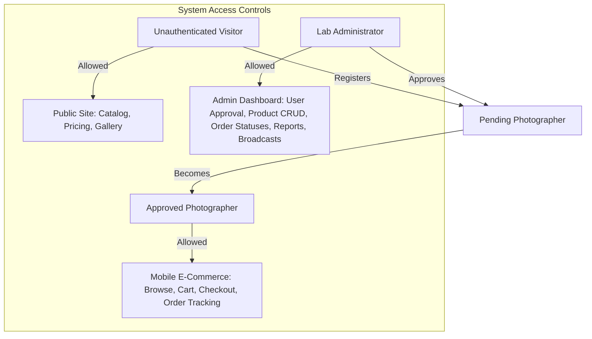

# Product Requirements Document (PRD) — SD Colours Photobook Lab

## 1. Executive Summary & Product Vision

### 1.1 Overview
**SD Colours Photobook Lab** is a premier, specialized photo printing and custom album manufacturing facility located in Rourkela, Odisha, India. The lab caters specifically to professional wedding and event photographers, providing top-tier, high-quality printing services including custom Combo Photo Pads, premium Flush Mount albums, LED photo frames, and crystal-clear Wall Acrylic photo prints.

### 1.2 The Problem Statement
Professional photographers handle large volumes of high-resolution digital prints and custom-bound albums. Historically, placing album orders involved tedious manual coordination, inconsistent sizing specifications, lack of order-status transparency, and high administrative overhead for lab managers tracking approvals, pricing tiers, and paper quality.

### 1.3 The Solution (Unified Business Ecosystem)
The SD Colours Photobook Lab digital ecosystem bridges these gaps through a four-tier architecture:
1. **Next.js 16 Marketing Site**: A high-impact, premium public-facing catalog and gallery to attract new photographers and showcase the lab's premium craftsmanship (Gold, Platinum, Wooden series).
2. **PHP Core Engine & PostgreSQL Backend**: A robust, lightweight legacy engine that acts as the secure relational data warehouse and hosts the REST API layer for all client applications.
3. **Flutter Photographer Mobile App**: A fast, client-centric native mobile application allowing verified photographers to search catalogs, customize album pages/sizes, manage carts, submit orders, and track job statuses on the go.
4. **Flutter Windows Desktop Admin Console**: An intensive, powerful office dashboard for lab operators to approve/verify photographer accounts, edit live pricing tiers, update production queues, issue push notifications, and export financial summaries.

---

## 2. Target Personas & User Roles

The system strictly enforces role-based access control (RBAC) across three user types:



### 2.1 Public Guest / Visitor
* **Profile**: Freelance photographers, event coordinators, or local clients browsing the web for printing services.
* **Context**: Seeks rapid validation of print quality, list of combo styles, active product pricing, and simple contact routes.
* **Key Goal**: Browse public catalogs, view the high-definition gallery, and register for a professional partner account or initiate contact via WhatsApp.

### 2.2 Registered Professional Photographer (Mobile E-Commerce User)
* **Profile**: B2B photography studio owners, wedding filmmakers, and premium portrait photographers.
* **Context**: Requires a seamless shop-like experience to select customized print dimensions, calculate dynamic pricing, and monitor production status in real-time.
* **Key Goal**: Order complex combo sets, configure pages (Regular, NTR, Velvet, Silky sheets), track order history, and communicate special lab instructions.

### 2.3 Lab Administrator / Production Manager (Desktop Operator)
* **Profile**: SD Colours business owners, print operators, and office managers.
* **Context**: Operates on high-resolution widescreen displays, managing accounts, verifying studio credentials, and moving production queues quickly.
* **Key Goal**: Approve photographer sign-ups, adjust product lines and pricing structures, update order stages (e.g., from `pending` to `processing`), broadcast status updates, and run financial audits.

---

## 3. Product Feature Matrix (Across All Sub-Projects)

The ecosystem features are distributed logically across four client/server configurations to align with users' operational devices:

### 3.1 Next.js 16 Marketing Website (Desktop & Mobile Responsive Web)
Built with Next.js 16 App Router, React 19, Vanilla CSS, and optimized for speed and SEO.
* **Interactive Hero Showcase**: Visual introduction to SD Colours Photobook Lab highlighting signature leather, acrylic, and premium wooden craftsmanship.
* **Dynamic Combo Pad Catalog**: Clean, filtrable grid displaying the signature premium sets (e.g., *Gold+ 6-in-1*, *Platinum 6-in-1*, *Drawerio 3-in-1*) with list prices and item compositions.
* **High-Performance Gallery**: Multi-category media board (Combos, Albums, Frames, Acrylics) rendering compressed web-ready graphics.
* **Dynamic Pricing Reference**: Responsive tables showing cost per page (Velvet, Silky, NTR, Lustre sheets) and volume-tiered pricing.
* **Lead Capture & WhatsApp Integration**: Pre-templated WhatsApp routing for custom pricing requests, coupled with an interactive contact form.

### 3.2 Photographer Mobile App (`photographer_mobile_app`)
A Flutter application designed for Android and iOS, providing full B2B retail workflows.
* **Secure Registration & Auth**: Onboarding form requesting phone number, studio name, and city. Enforces a "Pending Verification" block screen until admin authorization.
* **Browse E-Commerce Store**: Category-specific tab sheets (Combos, Albums, LED Frames, Acrylics). Features rich animations and product sorting.
* **Dynamic Sheet Calculator**: Computes custom album prices in real-time based on sheet selection (Regular Glossy vs. Metallic/Sparkle 3D) and page counts.
* **Robust Session Cart**: Persistent local cart supporting bulk quantities, print-dimension variations, and tailored instruction remarks.
* **Order History & Production Milestones**: Chronological list of orders with visual status timeline (e.g., *Printed*, *Bound*, *Shipped*).

### 3.3 Lab Windows Desktop App (`lab_desktop_app`)
A Flutter Windows Desktop application optimized for fast-paced administrative office workflows.
* **Photographer KYC & Verification Panel**: Simple approve/reject table. Displays candidate phone number, studio details, and sign-up date.
* **Dynamic Production Queue**: Centralized pipeline showing orders grouped by status. Features search indexing by order ID or studio name.
* **Product Catalog & Price Controller (CRUD)**: Visual manager to instantly activate/deactivate products, adjust page rate structures, upload images, and re-order listings.
* **Financial & Production Analytics**: Reports dashboard offering metrics on total order volume, overall revenue, and item sales distributions.
* **Global Push & Broadcast Engine**: Broadcast messaging dashboard sending notification sheets or custom status updates directly to photographers' mobile apps.

### 3.4 PHP Engine & PostgreSQL Backend (Backend Engine)
An API-first backend providing secure relational databases, CORS compliance, and session states.
* **Dual Database Adaptability**: Compatible with standard local environments (MySQL/MariaDB via Laragon) and enterprise production cloud servers (PostgreSQL via PDO).
* **Token-Based Authentication**: Secure stateless Bearer Token engine generating cryptographic API keys with a 30-day longevity.
* **Administrative Session Portal**: Secure fallback web interface facilitating direct DB edits, order monitoring, and data backups.

---

## 4. Key Workflows & State Machines

### 4.1 Photographer KYC (Onboarding Flow)
To ensure exclusive B2B partner pricing, photographers must undergo verification before purchasing:

```
[Guest Photographer] ──> Submits Registration Form ──> Account status = 'pending'
                                                                 │
                                                                 ▼
[Lab Admin Desktop] <── Listens to Pending Accounts ── Shows phone/studio info
                                                                 │
                                          ┌──────────────────────┴──────────────────────┐
                                          ▼                                             ▼
                                   [Approve Action]                              [Reject Action]
                                          │                                             │
                                          ▼                                             ▼
                             Account status = 'approved'                  Account status = 'rejected'
                                          │                                             │
                                          ▼                                             ▼
                             Photographer can log in & shop               Access denied with warning
```

### 4.2 Order Lifecycle (State Machine)
All orders transition through strict production phases, tracked visually by both admin and photographer:

```
      [Photographer Cart]
               │
               ▼ (Submit Checkout)
        ┌──────────────┐
        │   pending    │  <── Admin default. Customer can view.
        └──────────────┘
               │
               ▼ (Admin starts printing)
        ┌──────────────┐
        │  processing  │  <── Printing, binding, and quality checking.
        └──────────────┘
               │
               ▼ (Admin ships order)
        ┌──────────────┐
        │   shipped    │  <── Shipped via local courier. Tracking number added.
        └──────────────┘
               │
               ├──────────────────────────────┐
               ▼ (Courier confirms)           ▼ (Damaged/Issue)
        ┌──────────────┐              ┌──────────────┐
        │  delivered   │              │  cancelled   │
        └──────────────┘              └──────────────┘
```

---

## 5. Non-Functional & Operational Requirements

### 5.1 Security & Authentication
* All API requests to photographer and admin endpoints must include the HTTP header: `Authorization: Bearer <token>`.
* Password storage must utilize `bcrypt` hashing with a minimum work factor of `10`.
* Database connections must utilize strict prepared statements via PDO to neutralize SQL injection vulnerabilities.

### 5.2 Performance & Availability
* API endpoints must return valid JSON responses in less than `300ms` under normal operating loads.
* The Next.js marketing application must target a Google Lighthouse Performance and SEO score of `95+` through static page pre-rendering, responsive image loading (`next/image`), and minimal blocking CSS.

### 5.3 Reliability & Scalability
* The shopping cart must persist on the mobile client using a secure key-value store (e.g., `shared_preferences` or `hive`) to prevent data loss during network disruptions.
* Deleting a product must execute a logical state toggle (`active = 0`) instead of a raw SQL drop when order items link to the product ID, maintaining relational database integrity.
